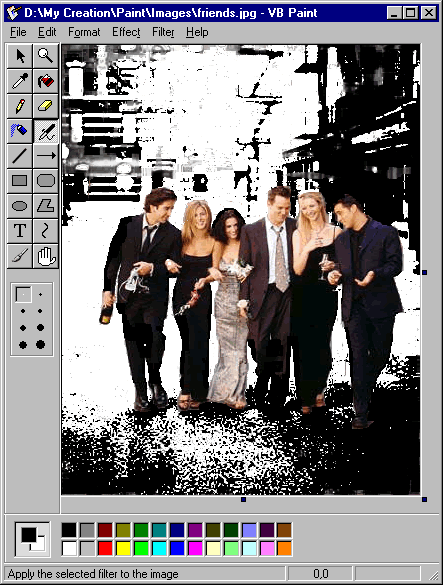



## VB Paint

### Description

VB Paint is a simple drawing program similar to Microsoft Paint plus several image filters. VB Paint features: (1) Drawing tools: curve, polygon, filter brush, brush (10 different shapes), air brush, text, fill, rectangle, square, rounded rectangle, rounded square, ellipse, circle, pencil, eraser and pick. (2) Drawing properties: foreground color, fill color, fill style, draw width, border style and font. (3) Selection tool: move, cut, copy, paste, delete, crop, effects, filters. (4) Effects: resize, flip horizontal/vertical, rotate, clear. (5) Filters: black and white, blur, brightness, crease, darkness, diffuse, emboss, gray black and white, grayscale, invert colors, replace colors, sharpen, snow and wave. (6) Undo/redo (limited by memory, currently I set it to 10x undo/redo). (7) Others: scroll bars, zoom, resizable paint area, hand, status bar, open, save, and print. It is well commented and developed with almost pure VB (only 7 APIs, no OCX, dll, ...). Good to learn about VB ability to handle graphical stuff.
 
### More Info
 

             |
---                |---
**Submitted On**   |2003-08-15 01:33:54
**By**             |[Theo Z](https://github.com/Planet-Source-Code/PSCIndex/blob/master/ByAuthor/theo-z.md)
**Level**          |Intermediate
**User Rating**    |4.9 (236 globes from 48 users)
**Compatibility**  |VB 6\.0
**Category**       |[Graphics](https://github.com/Planet-Source-Code/PSCIndex/blob/master/ByCategory/graphics__1-46.md)
**World**          |[Visual Basic](https://github.com/Planet-Source-Code/PSCIndex/blob/master/ByWorld/visual-basic.md)
**Archive File**   |[VB\_Paint1634998252003\.zip](https://github.com/Planet-Source-Code/theo-z-vb-paint__1-47566/archive/master.zip)

